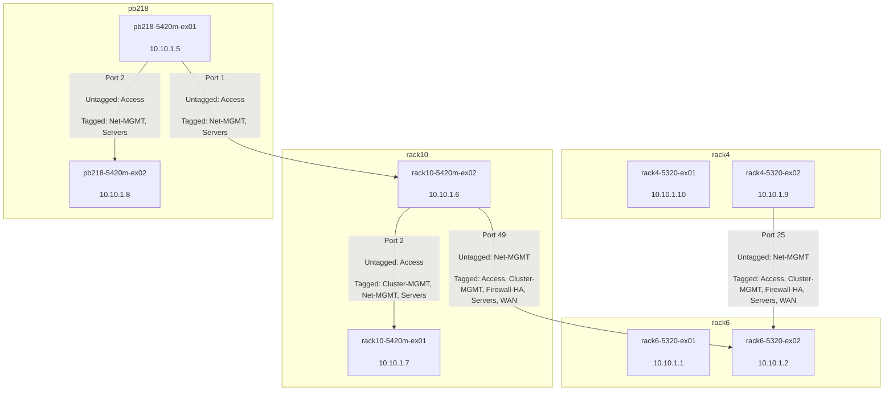

# Switch topology

```mermaid
flowchart TB

%% GRID ALIGNMENT HELPERS

%% These invisible nodes force equal-height columns & preserve strict grid look.

classDef spacer fill:transparent,stroke:transparent;

  

subgraph RACK4 [rack4]

direction TB

r4_top[ ]:::spacer

sw_rack4_5320_ex01["rack4-5320-ex01

10.10.1.10"]

sw_rack4_5320_ex02["rack4-5320-ex02

10.10.1.9"]

r4_bottom[ ]:::spacer

end

  

subgraph RACK6 [rack6]

direction TB

r6_top[ ]:::spacer

sw_rack6_5320_ex01["rack6-5320-ex01

10.10.1.1"]

sw_rack6_5320_ex02["rack6-5320-ex02

10.10.1.2"]

r6_bottom[ ]:::spacer

end

  

subgraph RACK10 [rack10]

direction TB

r10_top[ ]:::spacer

sw_rack10_5420m_ex01["rack10-5420m-ex01

10.10.1.7"]

sw_rack10_5420m_ex02["rack10-5420m-ex02

10.10.1.6"]

r10_bottom[ ]:::spacer

end

  

subgraph PB218 [pb218]

direction TB

pb_top[ ]:::spacer

sw_pb218_5420m_ex01["pb218-5420m-ex01

10.10.1.5"]

sw_pb218_5420m_ex02["pb218-5420m-ex02

10.10.1.8"]

pb_bottom[ ]:::spacer

end

  

%% INTER-SWITCH LINKS (GRID SAFE)

  

sw_pb218_5420m_ex01 -- "Port 1

Untagged: Access

Tagged: Net-MGMT, Servers" --> sw_rack10_5420m_ex02

sw_pb218_5420m_ex01 -- "Port 2

Untagged: Access

Tagged: Net-MGMT, Servers" --> sw_pb218_5420m_ex02

  

sw_rack10_5420m_ex02 -- "Port 2

Untagged: Access

Tagged: Cluster-MGMT, Net-MGMT, Servers" --> sw_rack10_5420m_ex01

  

sw_rack10_5420m_ex02 -- "Port 49

Untagged: Net-MGMT

Tagged: Access, Cluster-MGMT, Firewall-HA, Servers, WAN" --> sw_rack6_5320_ex02

  

sw_rack4_5320_ex02 -- "Port 25

Untagged: Net-MGMT

Tagged: Access, Cluster-MGMT, Firewall-HA, Servers, WAN" --> sw_rack6_5320_ex02
```
